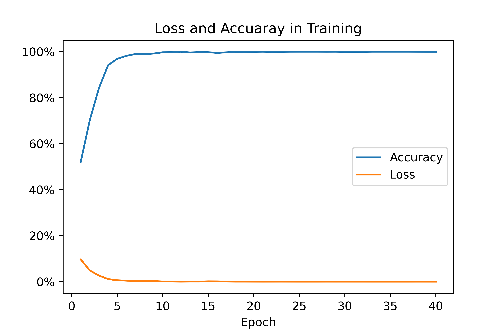

# Real_Time_Car_Recognication_Based_on_CNN

it is used to classification BMW from other vehicles

in PC has 2 way to test camera, 
    
    1. Using PPT + OpenCV2, monitoring desktop.
    2. Based on "1", using DroidCamApp (WebCamera by using phone).

----

## [Accuracy and Loss in training](./Loss_Acc_Visualization.py)

---

## [In Verificaiton](./verificaiton.py)
Accuracy

torch 1.6: 97.46%, each image needs 0.0006327 sec to classification in PC

torch 1.4: 96.16%

---

## Real-Time Test
### [In PC](./Real-Time-test/PC.py):

### [In Jetson_Nano](./Real-Time-test/Jetson_Nano.py):

